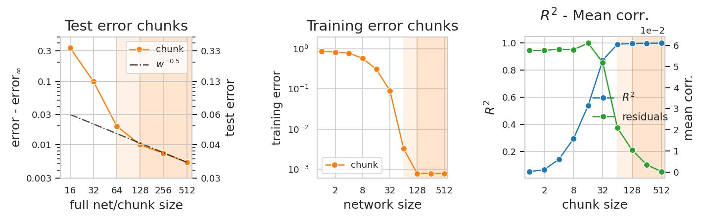

# Redundant representation help generalization

Source code of the paper [Redundant represenatation help generalization in wide neural networks](https://openreview.net/pdf?id=lC5-Ty_0FiN)
published at NeurIPS 35 


## Platforms:
- Ubuntu 22.04

## Install

You can get miniconda from https://docs.conda.io/en/latest/miniconda.html, or install the dependencies shown below manually.

```
conda create -n redundant_repr                                #create empy environment named "redundant_repr"
conda activate redundant_repr
conda install python numpy matplotlib seaborn scikit-learn    #install relevant python packages
conda install pytorch cpuonly -c pytorch          
```

## Download data and reproduce plots of CIFAR10 on Wide-ResNet28_8

Download the CIFAR10 representations of the second-to-last layer of Wide-ResNet28_8. The data is saved in "./data/download_repr":

```
python download.py 
```

Compute the test/training error of the chuncks, the R^2 coefficient of fit of the chunks to the full-layer representation, and the mean correlation of the chunks. The results are saved in "./data/results". The '--r2_rep' and '--acc_rep' arguments allow to set the number of chunks on which the r2/mean_corr and accuracies are averaged:

```
python analysis_repr.py --r2_rep 40 
```

Plot the results. The plots are saved in "./plots":
```
python plot_results.py
```

## Figures of  CIFAR10 on Wide-ResNet28-8
The code above allows to reproduce the the figures 3.b, 4.b and 4.e of the paper. The profiles can be made smoother by increasing the number of chunks on which the statistics are computed. The plots are shown below:



more data will be added soon


## Train the netowork from scrutch and estract the representations

### _This part of repository is under development_
